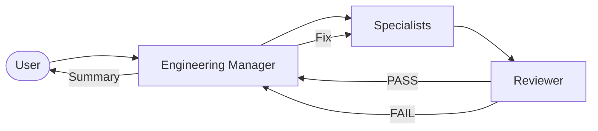
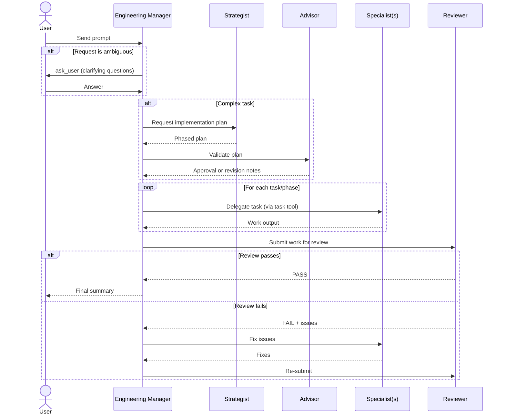
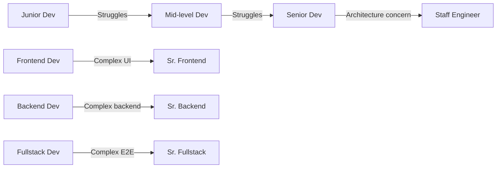
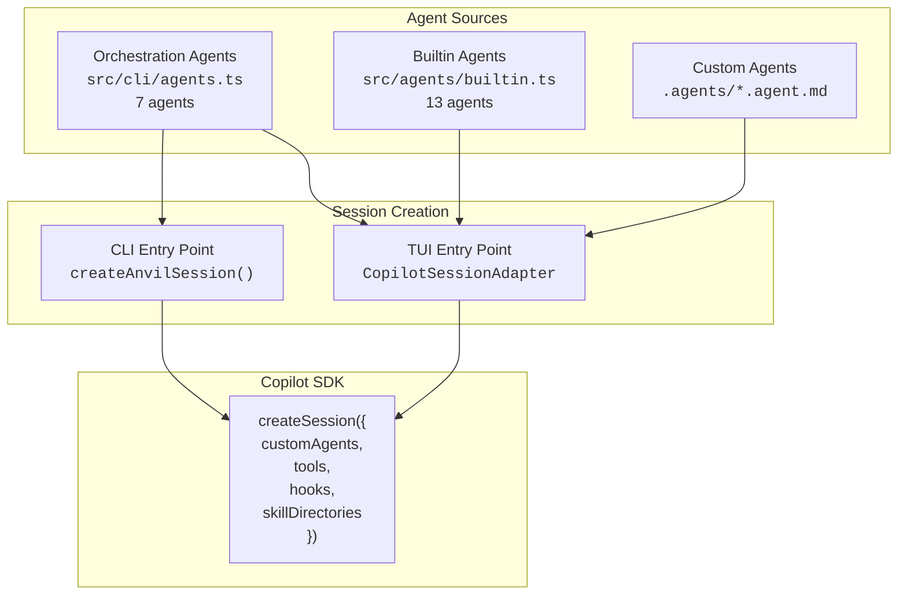
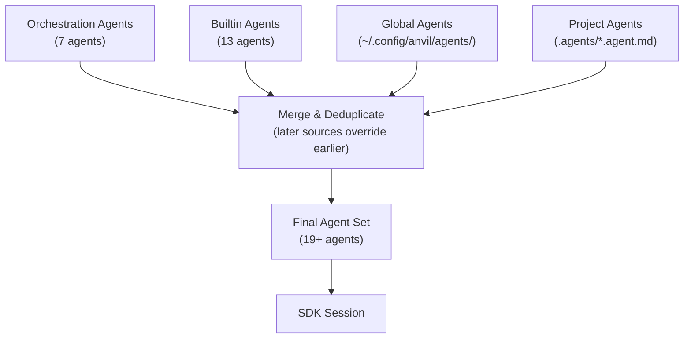
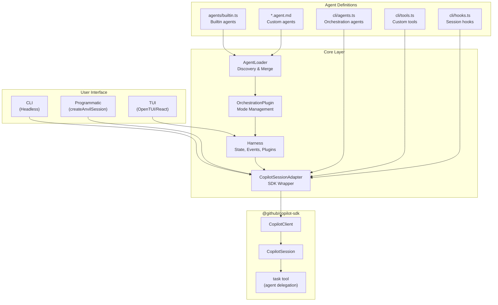
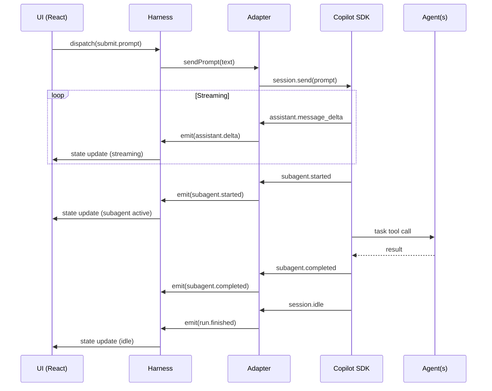

# Agent Orchestration

This document explains how Anvil's multi-agent orchestration system works — from the high-level request flow down to the SDK primitives that make it possible.

## Overview

Anvil models a **software engineering team** as a set of AI agents, each with a specific role. When a user sends a message, the system routes it through a structured pipeline:



The key constraint: **all of this happens within a single premium request**. The SDK's `customAgents` mechanism allows agent-to-agent delegation via its built-in `task` tool without consuming additional API calls.

---

## Agent Catalog

### Agent Hierarchy

```mermaid
graph TD
    subgraph Coordination["Coordination Layer"]
        EM[Engineering Manager<br/><i>Orchestration</i>]
        Strat[Strategist<br/><i>Planning</i>]
        Adv[Advisor<br/><i>Plan Validation</i>]
    end

    subgraph Investigation["Investigation"]
        Arch[Architect<br/><i>Systems Analysis</i>]
        Nav[Navigator<br/><i>Code Knowledge</i>]
        Scout[Scout<br/><i>Fast Search</i>]
    end

    subgraph Implementation["Implementation"]
        SE[Staff Engineer<br/><i>Deep Worker</i>]
        JD[Junior Dev]
        FD[Frontend Dev]
        BD[Backend Dev]
        FSD[Fullstack Dev]
        SFD[Sr. Frontend]
        SBD[Sr. Backend]
        SFSD[Sr. Fullstack]
    end

    subgraph Specialist["Domain Specialists"]
        DE[Data Engineer]
        Des[Designer]
        PW[Prompt Writer]
        DO[DevOps]
    end

    subgraph Quality["Quality Gate"]
        Rev[Reviewer]
    end

    EM --> Strat
    EM --> Adv
    EM --> Arch
    EM --> Nav
    EM --> Scout
    EM --> SE
    EM --> JD
    EM --> FD
    EM --> BD
    EM --> FSD
    EM --> SFD
    EM --> SBD
    EM --> SFSD
    EM --> DE
    EM --> Des
    EM --> PW
    EM --> DO
    EM --> Rev
    Strat -.-> Adv
```



### Agent Descriptions

| Agent | Source | Role | When to Use |
|-------|--------|------|-------------|
| **Engineering Manager** | `cli/agents.ts` | Coordinator | Decomposes tasks, delegates, coordinates |
| **Strategist** | `cli/agents.ts` | Planner | Complex tasks needing phased plans |
| **Advisor** | `cli/agents.ts` | Plan critic | Validate plans before execution |
| **Staff Engineer** | `cli/agents.ts` | Deep worker | Autonomous multi-file implementations |
| **Architect** | `cli/agents.ts` | Analyst | Debugging, root-cause analysis, architecture review |
| **Navigator** | `cli/agents.ts` | Knowledge | Codebase exploration, pattern documentation |
| **Scout** | `cli/agents.ts` | Fast search | Quick read-only file/code searches |
| **Junior Dev** | `builtin.ts` | Implementation | Small fixes, config changes (<50 lines) |
| **Frontend Dev** | `builtin.ts` | Implementation | UI components, styling, client-side logic |
| **Backend Dev** | `builtin.ts` | Implementation | APIs, databases, server logic |
| **Fullstack Dev** | `builtin.ts` | Implementation | End-to-end features |
| **Sr. Frontend** | `builtin.ts` | Implementation | Complex UI architecture (5+ files) |
| **Sr. Backend** | `builtin.ts` | Implementation | Distributed systems, security |
| **Sr. Fullstack** | `builtin.ts` | Implementation | Complex integrations, migrations |
| **Data Engineer** | `builtin.ts` | Specialist | SQL, ETL, data transformations |
| **Designer** | `builtin.ts` | Specialist | UI/UX decisions, styling guidance |
| **Prompt Writer** | `builtin.ts` | Specialist | LLM prompt engineering |
| **DevOps** | `builtin.ts` | Specialist | Git, CI/CD, deployment |
| **Reviewer** | `builtin.ts` | Quality gate | Code review, security audit |

---

## Request Flow

### Complete Pipeline



### Step-by-Step

1. **Engineering Manager** (coordinator): Analyses the request. If the request is ambiguous, uses the `ask_user` tool to gather clarification. For complex tasks, asks the Strategist for a plan and the Advisor to validate it. Breaks work into tasks and delegates each to the appropriate specialist agent.

2. **Specialists** (workers): Execute their assigned tasks. They have access to file read/write/search tools. If stuck, they can signal the need for escalation.

3. **Reviewer** (quality gate): Reviews all work product before the final response. Returns PASS or FAIL with specific issues. Failed reviews are routed back through the Engineering Manager for fixes.

---

## Escalation

The Engineering Manager follows a **start-low, escalate-up** strategy:



**Escalation triggers:**
- Agent reports being stuck or unable to complete the task
- Security-sensitive implementation identified
- Architectural decision required
- Performance-critical path detected
- Task scope exceeds the agent's tier capability

The Engineering Manager never retries the same agent — it always escalates to a more capable one.

---

## How It Works (SDK Layer)

### Agent Registration

All agents are registered as SDK `customAgents` when creating a session:



### The `task` Tool

The SDK provides a built-in `task` tool that enables agent-to-agent delegation. When the Engineering Manager needs to delegate:

1. The Engineering Manager calls `task` with the target agent name and prompt
2. The SDK routes the call to the specified `customAgent`
3. The subagent executes within the same request context
4. The result is returned to the calling agent

This is why **1 message = 1 premium request** — subagent invocations are internal SDK operations, not separate API calls.

### Tools

Anvil registers four custom tools alongside the SDK's built-in tools:

| Tool | Purpose |
|------|---------|
| `enforce_checklist` | Prevents agents from abandoning incomplete work |
| `summarize_context` | Compresses context for lean subagent delegation |
| `check_conventions` | Scans for project convention files |
| `project_overview` | Quick structural overview of the project |

### Session Hooks

Four hooks add guardrails to the execution pipeline:

| Hook | When | What it does |
|------|------|-------------|
| `onPreToolUse` | Before any tool runs | Warns about destructive commands; injects convention context |
| `onPostToolUse` | After any tool runs | Flags TODO/FIXME markers in written files |
| `onUserPromptSubmitted` | When user sends a message | Enriches prompt with git branch and project stack info |
| `onSessionStart` | When session is created | Loads CLAUDE.md/AGENTS.md as project context |

---

## Two Agent Sources

Anvil has two categories of agents that are merged at session creation time:

### Orchestration Agents (`src/cli/agents.ts`)

These 7 agents are defined as SDK `CustomAgentConfig` objects and are registered directly with the SDK. They provide the coordination layer:

- Engineering Manager, Staff Engineer, Architect, Navigator, Scout, Strategist, Advisor

### Builtin Agents (`src/agents/builtin.ts`)

These 13 agents are defined as `AgentDefinition` objects and loaded via the `AgentLoader`. They provide the implementation and specialist layer:

- Engineering Manager (metadata), Junior Dev, Frontend Dev, Backend Dev, Fullstack Dev, Sr. Frontend, Sr. Backend, Sr. Fullstack, Data Engineer, Designer, Prompt Writer, DevOps, Reviewer

### Merge Strategy



**Priority order** (later overrides earlier):
1. Builtin agents (lowest priority)
2. Global agents (`~/.config/anvil/agents/`)
3. Project agents (`.agents/*.agent.md`)
4. Orchestration agents (always included, supersede old `orchestrator`/`planner` if present)

---

## Orchestration Modes

The TUI supports two modes:

| Mode | Command | Behavior |
|------|---------|----------|
| **Direct** | `/direct` | Prompts go directly to the default Copilot model |
| **Team** | `/team` | Prompts route through Engineering Manager -> Specialists |

Team mode is enabled automatically when agents are loaded. The `OrchestrationPlugin` manages the mode state and sets Engineering Manager as the entry-point agent.

In CLI mode, orchestration agents are always active. The user's prompt is sent directly, and the system prompt instructs the model to delegate to the Engineering Manager for complex tasks.

---

## Creating Custom Agents

### Agent File Format

Create `.agent.md` files with YAML frontmatter:

```markdown
---
name: Security Analyst
description: Analyses code for security vulnerabilities
model: claude-sonnet-4.6
tools: ['read', 'search', 'grep']
tier: specialist
domain: review
escalatesTo: Senior Backend Developer
---

You are a Security Analyst. You review code for security vulnerabilities
following OWASP guidelines...

## What You Check
- SQL injection
- XSS vulnerabilities
- Authentication bypasses
- Secrets in code
...
```

### Frontmatter Fields

| Field | Required | Description |
|-------|----------|-------------|
| `name` | Yes | Display name and identifier |
| `description` | Yes | Short description for UI display |
| `model` | No | Model to use (default: `claude-sonnet-4.6`) |
| `tools` | No | List of tools available to the agent |
| `tier` | No | `junior`, `mid`, `senior`, or `specialist` (auto-inferred from name) |
| `domain` | No | Routing domain (auto-inferred from name) |
| `escalatesTo` | No | Agent name to escalate to when stuck |

### Placement

- **Project-specific**: `.agents/my-agent.agent.md` (highest priority)
- **Global**: `~/.config/anvil/agents/my-agent.agent.md`

---

## Architecture Deep Dive

### System Architecture



### Event Flow (TUI)



---

## Design Decisions

### Why separate agent sources?

Builtin agents (in `builtin.ts`) use Anvil's `AgentDefinition` type and are loaded via the `AgentLoader`, which supports the three-tier priority system (builtin < global < project). This allows users to customize the implementation team.

Orchestration agents (in `cli/agents.ts`) use the SDK's `CustomAgentConfig` type and are always registered. They form the coordination backbone that shouldn't be overridden by user agents.

### Why not one session per agent?

The original design (from the `vscode-agents` model) used separate sessions per agent role. Anvil uses a single session with `customAgents` instead because:

1. **Cost**: 1 session = 1 premium request. Multiple sessions = multiple requests.
2. **Context**: Agents within the same session share context automatically.
3. **Simplicity**: No manual state passing between sessions.

### Why enforce escalation?

Starting with the lowest-capable agent (Junior Dev) and escalating only when needed optimizes for both speed and cost. Simple tasks complete faster with lightweight agents, while complex tasks still reach senior agents when needed.
